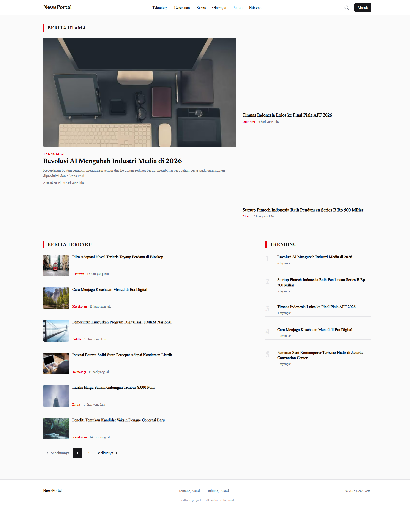
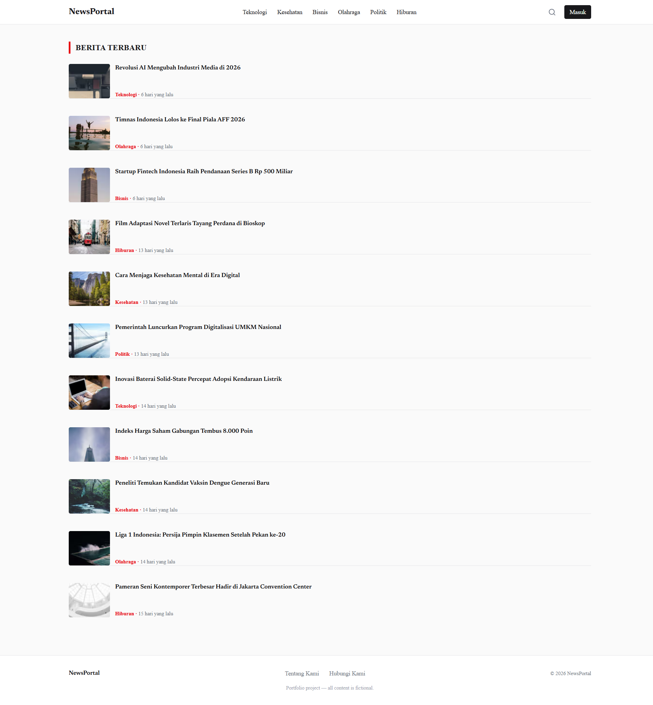
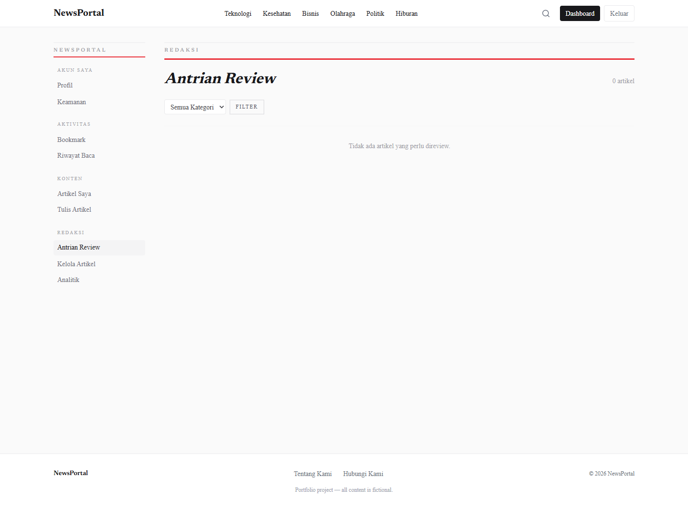
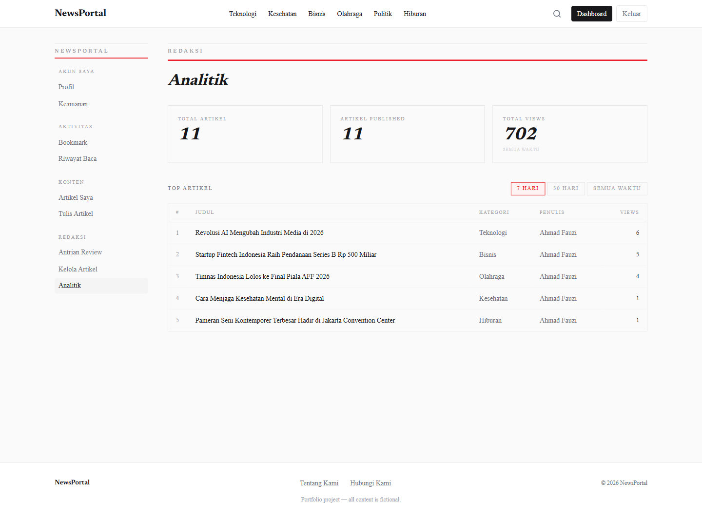
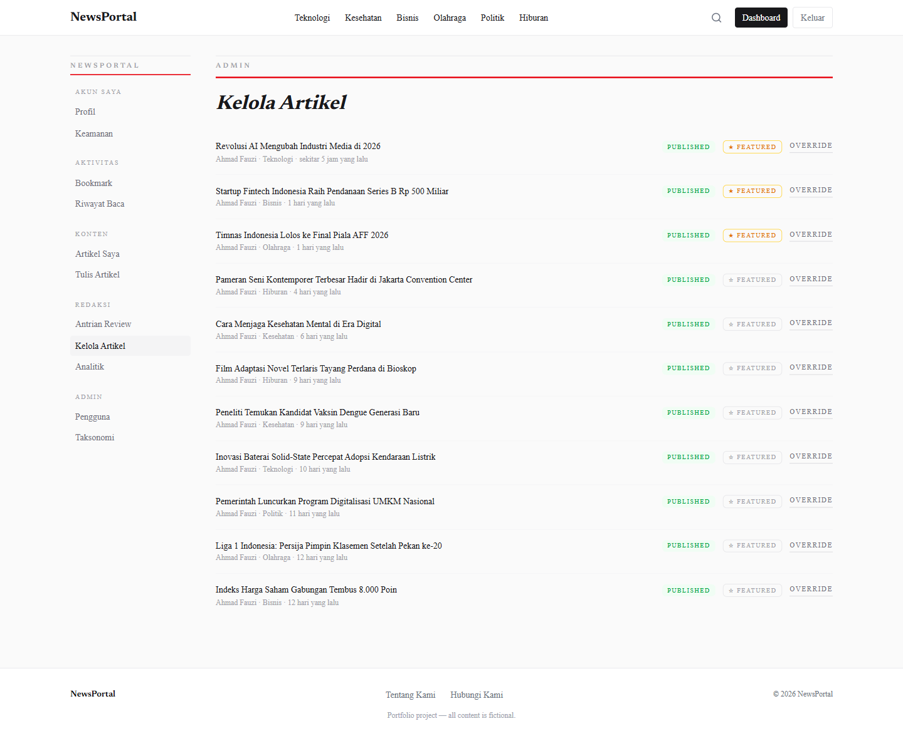
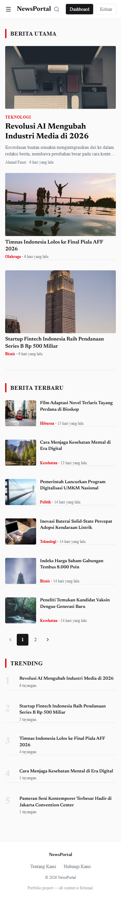
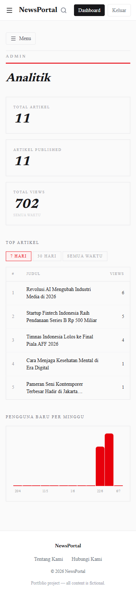
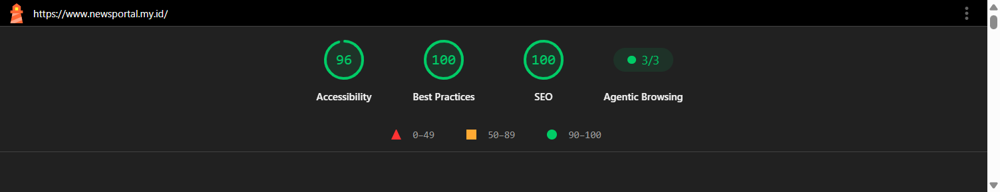

# NewsPortal

[](https://github.com/MohdFarhanS/newsportal/actions/workflows/ci.yml)

Portfolio project — a modern Indonesian-language news portal built with Next.js 15, featuring curated articles, a role-based content management system, and real-time tracking of trending articles.

Built for realistic exploration of editorial workflows—featuring four roles with a complete draft-review-publish workflow and race-condition protection—rather than the typical single-role CRUD blog commonly found in learning projects.
🔗 Live Demo: [newsportal.my.id](https://newsportal.my.id)

## Screenshots

**Demo — Editorial Workflow** (submit → review → approve)

https://github.com/user-attachments/assets/cd6c7869-e4f9-464c-a81b-405fb5d0ceaf

<table>
  <tr>
    <td width="50%"><br><sub>Homepage</sub></td>
    <td width="50%"><br><sub>Listing artikel (/latest)</sub></td>
  </tr>
  <tr>
    <td width="50%"><br><sub>Review Queue — Editor<br><em>no articles pending review at the time this screenshot was taken</em></sub></td>
    <td width="50%"><br><sub>Analytics Dashboard</sub></td>
  </tr>
  <tr>
    <td width="50%"><br><sub>Admin Override — Manage Articles</sub></td>
    <td width="50%"></td>
  </tr>
</table>

<table>
  <tr>
    <td width="50%"><br><sub>Homepage (mobile)</sub></td>
    <td width="50%"><br><sub>Analytics Dashboard (mobile, Admin)</sub></td>
  </tr>
</table>

> **Notes:** All articles, journalists, and other content are fictional and created for the purpose of demonstrating full-stack development skills.

---

## Highlights

- **Full-stack production-grade** — Next.js 15 App Router, TypeScript strict, PostgreSQL (Prisma), NextAuth v5, deploy di Vercel
- **Editorial workflow lengkap** — 4 role (User/Journalist/Editor/Admin), alur draft → review → schedule → publish dengan proteksi race-condition
- **256 automated E2E test** (Playwright) — auth, RBAC, accessibility (WCAG 2.1 AA), security, semuanya passed
- **SEO-ready** — Lighthouse SEO 100/100, JSON-LD structured data, dynamic sitemap, llms.txt
- **Security-hardened** — rate limiting, sanitasi HTML dua layer, security headers, session re-validation


_Lighthouse audit — live production, desktop_

---

## Tech Stack

| Layer         | Tech                                                      |
| ------------- | --------------------------------------------------------- |
| Framework     | Next.js 15.5 (App Router, Turbopack)                      |
| Language      | TypeScript 5                                              |
| Database      | PostgreSQL + Prisma 7 (PG adapter)                        |
| Auth          | NextAuth v5 (beta) — Credentials provider, JWT            |
| UI            | Shadcn/ui, Radix UI, Tailwind CSS v4                      |
| Rich Text     | TipTap 3                                                  |
| Images        | Cloudinary via Next Cloudinary                            |
| Email         | Resend                                                    |
| Rate Limiting | Upstash Redis                                             |
| Validasi      | Zod v4 + React Hook Form                                  |
| Data Fetching | TanStack Query v5                                         |
| Analytics     | Vercel Analytics                                          |
| Sanitasi HTML | sanitize-html (save-time + display-time, allowlist-based) |
| Fonts         | Newsreader (heading) + Roboto (body) — Google Fonts       |
| E2E Testing   | Playwright — 256 tests across 11 critical areas           |
| A11y Testing  | `@axe-core/playwright` — WCAG 2.1 AA runtime scan         |

---

## Features

### Public

- Homepage with **Featured**, **Latest** (paginated), and **Trending** (last 7 days) sections
- Article details with view tracking (automatic deduplication by IP)
- List articles at `/latest` and `/category/[slug]` with pagination
- Author Page `/author/[username]`
- Search + filter by category / tag / time range (`/search`)
- Dynamic category navigation (top 6 categories)
- About and Contact Pages

### Authentication & Authorization

- Log in / Sign up with your email and password
- Forgot & reset password via a time-limited, one-time-use email link
- Role-based access control: `USER`, `JOURNALIST`, `EDITOR`, `ADMIN`
- Automatic user sessions are terminated when an account is suspended or a password is changed
- Rate limiting on sensitive endpoints (login, register, forgot/reset password, search)

### User Dashboard

- Edit profile: name, bio, social media links
- Upload an avatar (PNG / JPEG / WebP, max 5 MB, automatically cropped to a square)
- Change Password
- Bookmark an article — save or remove it from the article page; view all bookmarks at `/dashboard/bookmarks` with pagination
- Reading history — automatically recorded when you log in, sorted by most recent at `/dashboard/history`; delete items individually or all at once

### Content Management _(CMS Dashboard)_

- Article Status: `DRAFT` → `REVIEW` → `PUBLISHED` / `REJECTED` / `SCHEDULED`
- Featured articles (max. 3, manually curated)
- Categories and tags
- Upload a cover image for the article
- Rich text editor (links, images)

### Administration _(ADMIN only)_

- **Manage Taxonomy** (`/dashboard/taxonomy`) — CRUD operations for categories and tags on a single page; deletion is blocked if the taxonomy is still used by any posts
- **Manage Users** (`/dashboard/users`) — filter and change roles, enable/disable accounts; admins cannot change or disable their own accounts

### Editorial Workflow

- **Submit for Review** — Journalists submit draft or rejected articles to the editor
- **Review Queue** (`/dashboard/review`) — editor/admin: view all REVIEW articles (in FIFO order), filter by category
- **Approve** — Publish articles directly from the queue
- **Schedule** — Schedule automatic future posts
- **Reject** — Reject with mandatory notes; to be shown to journalists
- **Admin Override** (`/dashboard/manage-articles`) — Change the status of any article without restrictions from the editorial workflow
- **Toggle Featured** — Mark published articles as “featured” (up to 3 will appear on the homepage)

### Analytics Dashboard _(EDITOR & ADMIN)_

- Statistical summary: total articles, published articles, total views
- Top 10 articles by period (7 days / 30 days / all time)
- Chart of Weekly New User Growth _(ADMIN only)_

### SEO

- `robots.txt` and `sitemap.xml` dynamic
- Open Graph + Twitter Card on all pages
- Structured data (JSON-LD) for articles & organizations
- Custom 404 page
- `llms.txt` for AI crawler readiness

---

## Technical Highlights

### Security

- Password reset token: single-use, expires in 1 hour, stored as a SHA-256 hash
- The JWT is revalidated against the database with every request (`isActive`, `passwordChangedAt`) — automatically revoked upon suspension or password change
- Rate limiting (Upstash Redis) on sensitive endpoints — fail-open if the environment is empty or Upstash fails to connect at runtime; in production, this triggers one Sentry alert per cold start (`safeRateLimit()`, no longer silent)
- Complete security headers: CSP, HSTS, X-Frame-Options, X-Content-Type-Options, Referrer-Policy
- Centralized client IP resolution (`getClientIp`) — a Vercel edge-injected header priority in production, preventing rate-limiter bypass via spoofing `x-forwarded-for`
- Two-layer HTML sanitization (save-time + display-time) via `sanitize-html`, allowlist-based
- Error monitoring (Sentry) is integrated into production (client/server/edge) — Session Replay with explicit masking for all text and input, preventing data leaks on authentication pages (login/register/forgot-password)

### Reliability & Data Integrity

- TOCTOU guard (atomic `updateMany`) in concurrent article review actions — a race condition results in a 409 Conflict, not corrupted data
- Reading history using a `upsert` database — preventing duplicate entries
- Guard removes taxonomy: FK RESTRICT+ protected categories; tags are protected by the application guard only (cascade relationship at the DB level)
- View tracking deduplication per IP within a 24-hour window — prevents view-count inflation
- Graceful degradation pattern (`safeQuery` helper in `articles.ts`/`categories.ts`/`tags.ts`) isolates infra-level failures (DB connection errors, quota exhaustion) from application logic — affected sections render an empty state instead of throwing, keeping the rest of the page/site usable. Session re-validation (`auth()`) is similarly isolated with its own `.catch()` wherever it's awaited alongside other data fetches, so a session/DB hiccup doesn't block unrelated content from rendering.

### Performance

- Streaming highlights on the homepage — Featured/Latest/Trending are displayed separately
- `React.cache()` deduplicates database calls between `generateMetadata` and the page component
- A full database index for all frequently queried foreign keys, plus the `pg_trgm`/GIN trigram index for full-text search
- Image optimization: `next/image` + Cloudinary auto-format/quality, AVIF/WebP, 24-hour cache
- Cache analytics (`unstable_cache` + `revalidateTag`) — 60 seconds for statistics/top articles, 1 hour for user graphs, automatic invalidation upon related actions
- New user chart: a pure-CSS chart without external libraries, with timezone-aware weekly buckets (WIB)
- On-demand ISR — approve/override/toggle-featured/cron-publish otomatis me-revalidate halaman publik terkait

### Infrastructure

- Turbopack for development and production builds
- Connection pooling via the Prisma PostgreSQL adapter (Neon pooler)
- Vercel Cron for automatically publishing scheduled articles

### SEO & Discoverability

- Complete JSON-LD: `NewsArticle` (+ `publisher.logo`, `mainEntityOfPage`, `isAccessibleForFree`, `author.url`), `Organization` (+ `logo`), `WebSite` + `SearchAction`, `BreadcrumbList` — eligible for Rich Results/Top Stories
- `llms.txt` conforms to the spec [llmstxt.org](https://llmstxt.org) for AI crawler readiness

---

## Known Limitations

- Rate limiting (Upstash) remains fail-open if the environment variable is empty OR if Upstash fails to connect at runtime (requests are still processed without limits, in all environments) — safe for development environments that don’t have Upstash set up. In production, this condition is no longer silent: `safeRateLimit()` (`src/lib/rate-limit.ts`) sends one Sentry alert per cold start (`process.env.VERCEL_ENV === “production”`, throttled via a module-level flag) so that someone knows the protection is currently inactive — but it still does not block requests (purely for observability, not fail-closed)
- Uploading an avatar/cover image using an unsigned Cloudinary preset—there is already server-side validation (the Cloudinary Admin API is queried again before the URL is saved to the DB, `src/lib/cloudinary-verify.ts`) plus preset-level constraints in the Cloudinary dashboard, so bypassing the widget (uploading directly to the Cloudinary endpoint, skipping the UI) no longer gets through without validation. Signed uploads (where the server generates a signature before the upload is allowed) are noted as a potential future security enhancement but have not yet been implemented—the current setup is sufficient for the portfolio’s current scale.
- The footer disclaimer text has a contrast ratio below the WCAG AA standard (2.53:1, minimum 4.5:1) — an intentional design trade-off to ensure the disclaimer text does not stand out more than the copyright line; this has been detected in the test suite (`accessibility.spec.ts`) as a known gap and has not yet been fixed
- All article data is fictional/generated by a local generator (`prisma/seed.ts` + `prisma/seed-dummy-extra.ts`)
- Graceful degradation on database outages: homepage sections (Featured/Latest/Trending), navbar categories, and `sitemap.xml` fall back to empty results via a `safeQuery` wrapper when the DB is unreachable (e.g. Neon compute quota exhausted), instead of crashing the page or failing the build. This is intentionally *not* applied to slug-based lookups (`getArticleBySlug`, `getCategoryBySlug`) since they're paired with `notFound()` — silently returning empty data there would misrepresent a DB outage as a 404. Those routes still surface the error boundary (`error.tsx`/`global-error.tsx`) on DB failure. Verified manually in production during an actual Neon quota-exhaustion incident (Sentry issue NEWSPORTAL-P).

---

## How to Get Started

### Prerequisites

- Node.js 18+
- The [Neon](https://neon.tech) account — two branches: `production` (prod) and `dev` (local). Do not use a single branch for both.
- Cloudinary Account, Resend
- Upstash Redis account _(optional — rate limiting is skipped if the environment variable is missing)_

### 1. Clone & Install

```bash
git clone <https://github.com/MohdFarhanS/newsportal.git>
cd newsportal
npm install
```

### 2. Environment Variables

Create a `.env` file in the project root:

```env
# Database — “dev” branch for local use, “production” branch for Vercel
# DATABASE_URL  = pooler URL  (Next.js runtime)
# DIRECT_URL    = URL langsung  (prisma migrate deploy)
DATABASE_URL="postgresql://neondb_owner:<password>@<dev-branch-pooler-host>/neondb?sslmode=require&channel_binding=require"
DIRECT_URL="postgresql://neondb_owner:<password>@<dev-branch-direct-host>/neondb?sslmode=require&channel_binding=require"

# NextAuth
AUTH_SECRET="your-secret-key-min-32-chars"

# Upstash Redis (optional — rate limiting)
UPSTASH_REDIS_REST_URL="https://your-url.upstash.io"
UPSTASH_REDIS_REST_TOKEN="your-token"

# Cloudinary (upload avatar and article cover image)
CLOUDINARY_CLOUD_NAME="your-cloud-name"
CLOUDINARY_API_KEY="your-api-key"
CLOUDINARY_API_SECRET="your-api-secret"
NEXT_PUBLIC_CLOUDINARY_CLOUD_NAME="your-cloud-name"

# Email (Resend)
RESEND_API_KEY="re_your-api-key"

# App URL — use the production URL when deploying (https://yourdomain.com)
NEXT_PUBLIC_APP_URL="http://localhost:3000"

# Email sender (must be a domain verified on Resend)
EMAIL_FROM="no-reply@mail.yourdomain.com"

# Vercel Cron — generate using: node -e “require(‘crypto’).randomBytes(32).toString(‘hex’)”
# Set the same value in the Vercel Dashboard > Environment Variables
CRON_SECRET="your-random-hex-secret"
```

### 3. Setup Database

```bash
# Run the migration
npm run migrate

# (Optional) Sample seed data
npm run db:seed
```

Seed data includes:

- 1 journalist account: `journalist@newsportal.com` / `password123`
- 6 categories: Technology, Business, Sports, Entertainment, Health, Politics
- 8 tags: Breaking News, Exclusive, Analysis, Opinion, Investigation, Infographics, Video, Podcast
- 11 sample articles (3 featured, 8 regular) — each with a `coverImageUrl` from [picsum.photos](https://picsum.photos) (ID curated per article)

To test all roles in the development environment, also run:

```bash
npx tsx prisma/seed-test-accounts.ts
```

Create accounts: `user@test.com`, `journalist@test.com`, `editor@test.com`, `admin@test.com` — all with the password `password123`.

### 4. Run the Development Server

```bash
npm run dev
```

Open [http://localhost:3000](http://localhost:3000)

---

## Scripts

| Script                  | Command                                    | Description                                                                                                                                |
| ----------------------- | ------------------------------------------ | ------------------------------------------------------------------------------------------------------------------------------------------ |
| `dev`                   | `next dev --turbopack`                     | Run the development server with Turbopack                                                                                                  |
| `build`                 | `next build --turbopack`                   | Build the project for production                                                                                                           |
| `start`                 | `next start`                               | Run the production server                                                                                                                  |
| `lint`                  | `eslint`                                   | Run the code snippet                                                                                                                       |
| `typecheck` | `tsc --noEmit` | Run TypeScript type-check without emitting output |
| `migrate` | `prisma migrate deploy` | Apply all pending migrations to the database |
| `db:seed`               | `npx tsx prisma/seed.ts`                   | Seed sample data (articles, categories, tags) into the database                                                                            |
| `db:seed:test`          | `npx tsx prisma/seed-test-accounts.ts`     | Create 4 test accounts (USER/JOURNALIST/EDITOR/ADMIN) — you'll need `ALLOW_TEST_SEED=true` in `.env`                                       |
| `db:seed:admin`         | `npx tsx prisma/seed-admin.ts`             | Create/update an admin account using environment variables — safe for production                                                           |
| `db:seed:dummy`         | `npx tsx prisma/seed-dummy-extra.ts`       | Generate 36 additional dummy articles (using a local template, not an external API) — requires that `npm run db:seed` has already been run |
| `test:e2e`              | `playwright test`                          | Run the entire E2E test suite — make sure `npm run dev` is already running on port 3000                                                    |
| `test:e2e:ui`           | `playwright test --ui`                     | Run the E2E test suite in Playwright UI mode (debugging)                                                                                   |
| `test:a11y`             | `playwright test accessibility.spec.ts`    | Test accessibility (axe-core) in isolation                                                                                                 |
| `test:responsive`       | `playwright test responsiveness.spec.ts`   | Test responsiveness (overflow/nav-toggle/column-hide/reflow) in isolation                                                                  |
| `test:search`           | `playwright test search.spec.ts`           | Test search and filtering in isolation                                                                                                     |
| `test:bookmark-history` | `playwright test bookmark-history.spec.ts` | Test bookmarks and reading history in isolation                                                                                            |
| `test:analytics`        | `playwright test analytics.spec.ts`        | Test the analytics dashboard in isolation                                                                                                  |
| `test:security`         | `playwright test security.spec.ts`         | Test security (CSRF, rate limiting, XSS, headers) in isolation                                                                             |

---

## Route Protection

Configured in `src/lib/auth.config.ts` via the NextAuth `authorized` callback:

| Route                                                                                                   | Access                                                                            |
| ------------------------------------------------------------------------------------------------------- | --------------------------------------------------------------------------------- |
| `/dashboard`, `/dashboard/profile`, `/dashboard/security`, `/dashboard/bookmarks`, `/dashboard/history` | All logged-in roles                                                               |
| `/dashboard/manage-articles` | EDITOR & ADMIN (page-level protection via `auth()`) |
| `/dashboard/taxonomy`, `/dashboard/users` | ADMIN only (page-level protection via `auth()`) |
| `/dashboard/*` other                                                                                    | Login + role other than USER (JOURNALIST/EDITOR/ADMIN)                            |
| `/login`, `/register`                                                                                   | Redirect to `/` if the user is logged in (checked at the page level via `auth()`) |
| All other routes                                                                                        | Public                                                                            |

Middleware is applied to all routes except: `/api/*`, `/_next/*`, `/favicon.ico`, and PNG files.

> Auth split-config pattern: `auth.config.ts` is used in middleware (edge runtime, without DB queries). `auth.ts` is used in the server context with JWT revalidation against the DB on every request.
>
> **Important:** Guards for auth pages (`/login`, `/register`) **are not** implemented as middleware because middleware cannot query the database—stale JWT cookies can cause false positives. Guards are implemented at the page level using `auth()` from `auth.ts`, which performs database validation..
>
> **USER route matching** uses **exact match** (not `startsWith`) so that `/dashboard/profile-evil` does not pass through the whitelist because `/dashboard/profile` is on the allowed list.

---

## E2E Testing

Playwright E2E suite (`e2e/`) — **256 tests, all passed**, covering 11 critical areas: Authentication, RBAC, Editorial Workflow, Taxonomy Management, User Management, Accessibility (axe-core, WCAG 2.1 AA), Responsiveness, Search & Filtering, Bookmarks & Reading History, Analytics Dashboard, and Security (CSRF, rate-limit, XSS, security headers). Coverage is intentionally limited to high-risk areas, rather than being comprehensive across the entire application.

📊 [View the Full Test Report](https://mohdfarhans.github.io/newsportal/)

**Prerequisite:** `npm run dev` must already be running on port 3000 before running the test (`playwright.config.ts` reuses the existing server; it does not start a new dev server).

```bash
npm run test:e2e      # Run the entire suite
npm run test:e2e:ui   # UI mode (debugging)
```

In addition to running locally, this suite can also be run on-demand in CI via the GitHub Actions workflow **“E2E Tests”** (`.github/workflows/e2e.yml`, manually triggered via the Actions tab). It’s intentionally separated from `ci.yml` (lint/typecheck/build, which runs automatically on every push) into two separate workflows—so that regular pushes remain fast, while the heavier E2E suite (~20 minutes) runs only when needed.

Complete details for each suite (bugs found, rate-limit notes, testing techniques, known limitations) can be found in [`docs/TESTING.md`](docs/TESTING.md).

---

## Documentation

| Documents                                      | Contents                                                                                                                                                                               |
| ---------------------------------------------- | -------------------------------------------------------------------------------------------------------------------------------------------------------------------------------------- |
| [`docs/ARCHITECTURE.md`](docs/ARCHITECTURE.md) | Complete project structure, database schema (relationships + enumerations), [editorial workflow diagram](docs/ARCHITECTURE.md#editorial-workflow), query function references by module |
| [`docs/TESTING.md`](docs/TESTING.md)           | Details of the E2E test suite by area — coverage, bugs found, operational notes                                                                                                        |
