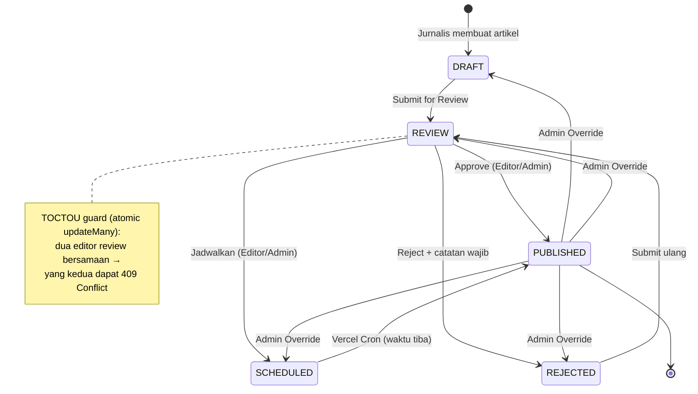

# Architecture

Referensi struktur proyek, skema database, dan fungsi query internal. Untuk gambaran fitur dan tech stack, lihat [README.md](../README.md).

---

## Struktur Proyek

```
newsportal/
├── e2e/                      # Playwright E2E test suite (auth, RBAC, editorial workflow, taxonomy, users, accessibility, responsiveness, search, bookmark/history, analytics, security)
│   ├── auth.setup.ts         # "setup" project: login × 4 role, simpan storageState
│   ├── auth.spec.ts          # Register, login, logout, rate limiting, invalidasi sesi saat suspend
│   ├── rbac.spec.ts          # Matriks akses per role × route, ownership check
│   ├── editorial-workflow.spec.ts  # Create→submit→approve/reject/schedule, TOCTOU, override, featured
│   ├── taxonomy.spec.ts       # Category/Tag CRUD, cascade-delete guard
│   ├── users.spec.ts          # Role/suspend management, self-guard
│   ├── accessibility.spec.ts  # axe-core WCAG 2.1 AA runtime scan, seluruh route publik+dashboard
│   ├── responsiveness.spec.ts # Overflow sweep, nav-toggle, column-hide, reflow checks @ 375/768/1024px
│   ├── search.spec.ts         # Text search, filter combinability, pagination+filter, page fallback
│   ├── bookmark-history.spec.ts # Bookmark toggle, auto-track riwayat baca, delete/clear-all, pagination
│   ├── analytics.spec.ts     # Summary stats, top artikel, grafik pengguna baru (cache-busted delta)
│   ├── security.spec.ts      # CSRF cookie flags + anonymous-401, rate-limit enforcement, XSS, security headers, malformed-body tolerance
│   ├── .auth/                # storageState JSON hasil login (gitignored)
│   └── utils/
│       ├── db.ts              # pg.Client raw SQL (bukan Prisma — generated client ESM-only): seed/cleanup throwaway user & artikel
│       ├── ids.ts              # newRunId(), penamaan email/judul throwaway (prefix e2e-/[E2E])
│       ├── a11y.ts             # Helper AxeBuilder (settle, scanForViolations, splitByImpact, formatViolations)
│       ├── responsive.ts       # BREAKPOINTS (375/768/1024px + boundary pairs), hasHorizontalOverflow()
│       └── global-teardown.ts # Sapu bersih data throwaway sisa setelah test run
├── prisma/
│   ├── migrations/          # Riwayat migrasi database
│   ├── schema.prisma        # Definisi skema database
│   └── seed.ts              # Script seeding data contoh
├── public/
│   ├── llms.txt                      # AI search readiness (llmstxt.org format)
│   ├── logo.png                      # Organization/publisher logo (512x512, JSON-LD Organization.logo + NewsArticle.publisher.logo)
│   ├── og-default.jpg                # Fallback OG/Twitter image (1200x630) untuk halaman tanpa cover image
│   ├── placeholder-article.jpg       # Fallback gambar artikel (ArticleCard) — sama dengan og-default.jpg
│   ├── placeholder-*.svg             # SVG placeholder lama (tidak dipakai seed, tetap ada sebagai fallback)
├── src/
│   ├── actions/
│   │   ├── article.ts          # Server Actions (createArticleAction, updateArticleAction, saveDraftAction, submitForReviewAction)
│   │   ├── auth.ts             # Server Actions (logout, changePasswordAction)
│   │   ├── bookmark.ts         # Server Actions (toggleBookmarkAction)
│   │   ├── profile.ts          # Server Actions (updateProfileAction)
│   │   ├── readingHistory.ts   # Server Actions (trackReadingHistoryAction, deleteReadingHistoryItemAction, clearReadingHistoryAction)
│   │   └── users.ts            # Server Actions (updateUserRoleAction, setUserActiveAction) — ADMIN only, self-guard
│   ├── app/
│   │   ├── api/
│   │   │   ├── articles/route.ts              # GET: search + filter artikel
│   │   │   ├── articles/[id]/submit/route.ts  # PATCH: submit artikel ke review (JOURNALIST/EDITOR/ADMIN, own article)
│   │   │   ├── articles/[id]/review/route.ts  # PATCH: approve/reject/schedule artikel (EDITOR/ADMIN only)
│   │   │   ├── articles/[id]/override/route.ts # PATCH: override status ke nilai apapun (ADMIN only)
│   │   │   ├── articles/[id]/feature/route.ts  # PATCH: toggle isFeatured (EDITOR/ADMIN, artikel harus PUBLISHED)
│   │   │   ├── categories/route.ts             # GET (public) / POST (ADMIN): kelola kategori
│   │   │   ├── categories/[id]/route.ts        # PATCH/DELETE (ADMIN): edit/hapus kategori
│   │   │   ├── tags/route.ts                   # GET (public) / POST (ADMIN): kelola tag
│   │   │   ├── tags/[id]/route.ts               # PATCH/DELETE (ADMIN): edit/hapus tag
│   │   │   ├── cron/
│   │   │   │   └── publish-scheduled/route.ts # GET: auto-publish SCHEDULED→PUBLISHED (auth: CRON_SECRET)
│   │   │   └── auth/
│   │   │       ├── [...nextauth]/route.ts     # NextAuth handler
│   │   │       ├── forgot-password/route.ts   # POST: kirim email reset
│   │   │       ├── register/route.ts          # POST: daftar akun baru
│   │   │       └── reset-password/route.ts    # POST: simpan password baru
│   │   ├── article/[slug]/
│   │   │   ├── HistoryTracker.tsx            # Client component: catat riwayat baca (auth-gated)
│   │   │   ├── ViewTracker.tsx               # Client component: track view
│   │   │   ├── loading.tsx                   # Skeleton: category + title + author + cover + body lines
│   │   │   └── page.tsx                      # Detail artikel (+ bookmark button untuk user login)
│   │   ├── author/[username]/
│   │   │   ├── loading.tsx                   # Skeleton: avatar header + article list
│   │   │   └── page.tsx                      # Halaman penulis
│   │   ├── category/[slug]/
│   │   │   ├── loading.tsx                   # Skeleton: section header + article list
│   │   │   └── page.tsx                      # Listing per kategori
│   │   ├── forgot-password/
│   │   │   ├── forgot-password-form.tsx
│   │   │   └── page.tsx
│   │   ├── latest/
│   │   │   ├── loading.tsx                   # Skeleton: section header + article list
│   │   │   └── page.tsx                      # Listing semua artikel
│   │   ├── login/
│   │   │   ├── login-form.tsx
│   │   │   └── page.tsx
│   │   ├── register/
│   │   │   ├── register-form.tsx
│   │   │   └── page.tsx
│   │   ├── reset-password/[token]/
│   │   │   ├── reset-password-form.tsx
│   │   │   └── page.tsx
│   │   ├── dashboard/
│   │   │   ├── layout.tsx                    # Sidebar + auth guard
│   │   │   ├── loading.tsx                   # Skeleton: konten area (sidebar tetap visible)
│   │   │   ├── page.tsx                      # Overview
│   │   │   ├── bookmarks/page.tsx            # Daftar bookmark user
│   │   │   ├── history/
│   │   │   │   ├── ClearHistoryButton.tsx    # Client: hapus semua riwayat (useTransition + toast + aria-busy)
│   │   │   │   ├── DeleteHistoryItemButton.tsx  # Client: hapus satu item (useTransition + toast + aria-busy)
│   │   │   │   └── page.tsx                  # Daftar riwayat baca
│   │   │   ├── profile/page.tsx              # Edit profil pengguna
│   │   │   ├── security/page.tsx             # Ganti password
│   │   │   ├── articles/
│   │   │   │   ├── page.tsx                  # Daftar artikel milik user
│   │   │   │   ├── new/page.tsx              # Tulis artikel baru
│   │   │   │   └── [id]/edit/page.tsx        # Edit artikel
│   │   │   ├── review/
│   │   │   │   ├── loading.tsx               # Skeleton: review queue list
│   │   │   │   ├── page.tsx                  # Antrian review (EDITOR/ADMIN)
│   │   │   │   └── [id]/
│   │   │   │       ├── loading.tsx           # Skeleton: review detail
│   │   │   │       ├── page.tsx              # Detail artikel untuk review
│   │   │   │       └── ReviewActions.tsx     # Client: approve/jadwalkan/reject dengan Shadcn Dialog
│   │   │   ├── analytics/
│   │   │   │   ├── loading.tsx               # Skeleton: stat cards + tab filter + tabel
│   │   │   │   └── page.tsx                  # Analytics (EDITOR/ADMIN; grafik pengguna hanya ADMIN)
│   │   │   ├── manage-articles/
│   │   │   │   ├── page.tsx                  # Kelola semua artikel (EDITOR/ADMIN)
│   │   │   │   └── OverrideActions.tsx       # Client: override status ke nilai apapun dengan Dialog
│   │   │   ├── taxonomy/
│   │   │   │   ├── page.tsx                  # Kelola kategori & tag (ADMIN)
│   │   │   │   ├── TaxonomyTabs.tsx          # Client: tab switcher kategori/tag + row list
│   │   │   │   ├── TaxonomyForm.tsx          # Client: Dialog create/edit (auto-slug dari nama)
│   │   │   │   └── DeleteTaxonomyButton.tsx  # Client: hapus dengan confirm + in-use guard
│   │   │   └── users/
│   │   │       ├── page.tsx                  # Kelola pengguna (ADMIN)
│   │   │       ├── RoleSelect.tsx            # Client: ubah role inline
│   │   │       └── SuspendToggle.tsx         # Client: aktifkan/nonaktifkan akun
│   │   ├── search/page.tsx                    # Pencarian + filter
│   │   ├── about/page.tsx
│   │   ├── contact/page.tsx
│   │   ├── not-found.tsx                      # Custom 404 page (editorial style)
│   │   ├── loading.tsx                        # Root loading skeleton (Suspense fallback)
│   │   ├── error.tsx                          # Root error boundary (client component)
│   │   ├── robots.ts                          # robots.txt dinamis
│   │   ├── sitemap.ts                         # sitemap.xml dinamis (articles + categories + static)
│   │   ├── globals.css
│   │   ├── layout.tsx                         # Root layout (Navbar, font, metadata, JSON-LD)
│   │   └── page.tsx                           # Homepage (Suspense streaming)
│   ├── components/
│   │   ├── bookmark/
│   │   │   └── BookmarkButton.tsx            # Toggle bookmark (client component, useTransition + toast)
│   │   ├── dashboard/
│   │   │   ├── ArticleForm.tsx               # Form create/edit artikel (shared, dengan autosave)
│   │   │   ├── ChangePasswordForm.tsx        # Change password form
│   │   │   ├── DashboardNav.tsx              # Sidebar nav role-aware (USER/JOURNALIST/EDITOR/ADMIN)
│   │   │   ├── ProfileForm.tsx               # Avatar + profile fields
│   │   │   └── TiptapEditor.tsx              # Rich text editor wrapper (TipTap 3)
│   │   ├── layout/
│   │   │   ├── Footer.tsx
│   │   │   ├── LogoutButton.tsx
│   │   │   ├── Navbar.tsx                     # Header sticky + navigasi kategori (desktop inline, mobile via Sheet drawer)
│   │   │   └── Pagination.tsx                 # Paginasi dengan ellipsis
│   │   ├── news/
│   │   │   ├── ArticleCard.tsx                # HeroCard, HorizontalCard, SecondaryCard, NumberedCard
│   │   │   ├── FeaturedSection.tsx
│   │   │   ├── LatestSection.tsx
│   │   │   ├── SectionHeader.tsx
│   │   │   └── TrendingSection.tsx
│   │   ├── providers/
│   │   │   └── QueryProvider.tsx              # TanStack Query QueryClientProvider wrapper
│   │   ├── search/
│   │   │   ├── FilterPanel.tsx                # Filter kategori / tag / tanggal
│   │   │   ├── SearchClient.tsx               # Client: useQuery + debounce + URL sync
│   │   │   └── SearchResults.tsx              # Hasil + skeleton loading
│   │   └── ui/
│   │       ├── button.tsx
│   │       ├── dialog.tsx
│   │       ├── input.tsx
│   │       ├── sheet.tsx
│   │       └── upload-widget.tsx              # Themed wrapper CldUploadWidget
│   ├── generated/
│   │   └── prisma/                            # Prisma client (auto-generated)
│   ├── lib/
│   │   ├── actions/
│   │   │   └── view.ts                        # Server Action: pelacakan view artikel
│   │   ├── hooks/
│   │   │   └── use-debounce.ts                # Custom hook debounce
│   │   ├── analytics.ts                       # getAnalyticsSummary, getTopArticles, getNewUsersPerWeek (server-only, unstable_cache)
│   │   ├── articles.ts                        # Query artikel (featured, latest, trending, search, related)
│   │   ├── auth.config.ts                     # Config NextAuth edge-safe (middleware)
│   │   ├── bookmarks.ts                       # Query bookmark: getUserBookmarks, isArticleBookmarked
│   │   ├── cms-articles.ts                    # Query CMS: getUserArticles, getArticleForEdit, getReviewQueue, getArticleForReview
│   │   ├── pagination.ts                      # parsePage() — validasi & clamp integer ?page= ke [1, 100_000]
│   │   ├── readingHistory.ts                  # Query riwayat baca: getUserReadingHistory
│   │   ├── auth.ts                            # NextAuth setup + re-validasi JWT ke DB
│   │   ├── authors.ts                         # Query penulis
│   │   ├── categories.ts                      # Query kategori (+ getAllCategoriesWithCount untuk admin)
│   │   ├── db.ts                              # Prisma client singleton
│   │   ├── email.ts                           # Kirim email via Resend
│   │   ├── rate-limit.ts                      # Rate limiter Upstash: getRateLimiter (5/15m), getSearchRateLimiter (30/1m)
│   │   ├── sanitize.ts                        # Shared sanitize-html options (allowlist: defaults + img)
│   │   ├── tags.ts                            # Query tag (+ getAllTagsWithCount untuk admin)
│   │   ├── users.ts                           # Query admin: getAllUsersAdmin (paginasi + filter role)
│   │   └── utils.ts                           # Helper cn() untuk Tailwind
│   ├── schemas/
│   │   ├── article.ts                         # Zod schemas: articleSchema, saveDraftSchema
│   │   ├── auth.ts                            # Zod schemas: login, register, reset password
│   │   ├── profile.ts                         # Zod schemas: profileSchema, changePasswordSchema
│   │   ├── taxonomy.ts                        # Zod schemas: categorySchema, tagSchema
│   │   └── users.ts                           # Zod schemas: updateUserRoleSchema, setUserActiveSchema
│   ├── types/
│   │   └── next-auth.d.ts                     # Augmentasi tipe NextAuth (id, role)
│   └── middleware.ts                           # Proteksi route via NextAuth
├── components.json          # Konfigurasi Shadcn/ui
├── next.config.ts           # Konfigurasi Next.js (Cloudinary remote pattern, security headers)
├── playwright.config.ts     # Konfigurasi Playwright E2E (webServer reuse port 3000, storageState per role)
├── prisma.config.ts         # Konfigurasi Prisma
├── tsconfig.json            # Konfigurasi TypeScript
└── vercel.json               # Vercel Cron jobs (publish-scheduled, hourly)
```

---

## Skema Database

### Relasi Antar Model

```
User ──────┬──── Profile (1:1)
           ├──── Article (1:many, sebagai author)
           ├──── Bookmark (1:many)
           ├──── ReadingHistory (1:many)
           └──── PasswordResetToken (1:many)

Category ──────── Article (1:many)

Tag ───────────── ArticleTag (join table)
Article ───────── ArticleTag (join table)

Article ────┬──── Bookmark (1:many)
            ├──── ReadingHistory (1:many)
            └──── ArticleView (1:many, tracking per IP)
```

### Enum

```prisma
enum Role          { USER, JOURNALIST, EDITOR, ADMIN }
enum ArticleStatus { DRAFT, REVIEW, PUBLISHED, REJECTED, SCHEDULED }
```

---

## Editorial Workflow

Alur transisi status artikel (`ArticleStatus`) dan peran yang berwenang di tiap transisi. Admin Override melewati batasan alur normal — bisa mengubah status apapun ke status apapun tanpa precondition.



---

## Arsitektur Komponen

### ArticleCard Variants

| Variant | Digunakan di | Deskripsi |
|---------|-------------|-----------|
| `HeroCard` | FeaturedSection | Kartu besar dengan gambar penuh, excerpt, info author |
| `SecondaryCard` | FeaturedSection | Kartu medium dengan gambar, kategori, timestamp |
| `HorizontalCard` | LatestSection, SearchResults | Kartu kompak horizontal dengan thumbnail kecil |
| `NumberedCard` | TrendingSection | Kartu ranking dengan nomor urut dan jumlah views |

### Query Artikel (`src/lib/articles.ts`)

| Fungsi | Keterangan |
|--------|------------|
| `getFeaturedArticles()` | 3 artikel published + isFeatured=true, urut publishedAt DESC |
| `getLatestArticles(page, perPage, includeFeatured?)` | Paginasi artikel published. `includeFeatured=false` (default) untuk homepage sidebar; `=true` untuk `/latest` |
| `getTrendingArticles()` | Top 5 artikel by views dalam 7 hari terakhir |
| `getArticleBySlug(slug)` | Detail artikel tunggal + tags (memoized dengan React `cache`) |
| `getRelatedArticles(categoryId, excludeSlug)` | 3 artikel terkait dalam kategori sama |
| `getArticlesByCategory(slug, page, perPage)` | Artikel per kategori, default 12/halaman |
| `getArticlesByAuthor(authorId, page, perPage)` | Artikel per penulis, default 12/halaman |
| `searchArticles(params)` | ILIKE search (didukung pg_trgm GIN index) + filter kategori / tag / tanggal |

### Query Bookmark (`src/lib/bookmarks.ts`)

| Fungsi | Keterangan |
|--------|------------|
| `getUserBookmarks(userId, page, perPage?)` | Semua bookmark milik user, urut createdAt DESC, default 12/halaman |
| `isArticleBookmarked(userId, articleId)` | Cek apakah artikel sudah di-bookmark user — single `findUnique` pada composite unique index |

### Query CMS (`src/lib/cms-articles.ts`)

| Fungsi | Keterangan |
|--------|------------|
| `getUserArticles(userId, page, perPage?)` | Semua artikel milik user, urut updatedAt DESC, default 12/halaman |
| `getArticleForEdit(id, userId)` | Artikel tunggal milik user untuk form edit (ownership check) |
| `getReviewQueue(page, perPage?, categorySlug?)` | Artikel berstatus REVIEW, urut updatedAt ASC (FIFO), opsional filter kategori |
| `getArticleForReview(id)` | Artikel tunggal berstatus REVIEW untuk halaman review detail; returns `null` jika bukan REVIEW |
| `getAllArticlesAdmin(page, perPage?)` | Semua artikel semua status semua penulis, urut updatedAt DESC, default 12/halaman — khusus halaman Kelola Artikel ADMIN |

### Query Reading History (`src/lib/readingHistory.ts`)

| Fungsi | Keterangan |
|--------|------------|
| `getUserReadingHistory(userId, page, perPage?)` | Semua riwayat baca milik user, urut readAt DESC, default 12/halaman; `upsert` di sisi action memastikan setiap artikel hanya muncul sekali |

### Query Admin (`src/lib/users.ts`)

| Fungsi | Keterangan |
|--------|------------|
| `getAllUsersAdmin(page, perPage?, role?)` | Semua pengguna, urut createdAt DESC, default 20/halaman, opsional filter role |
